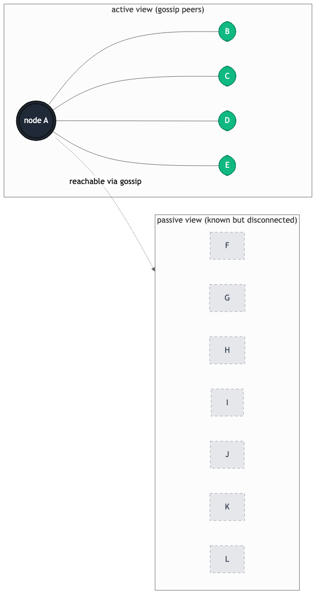
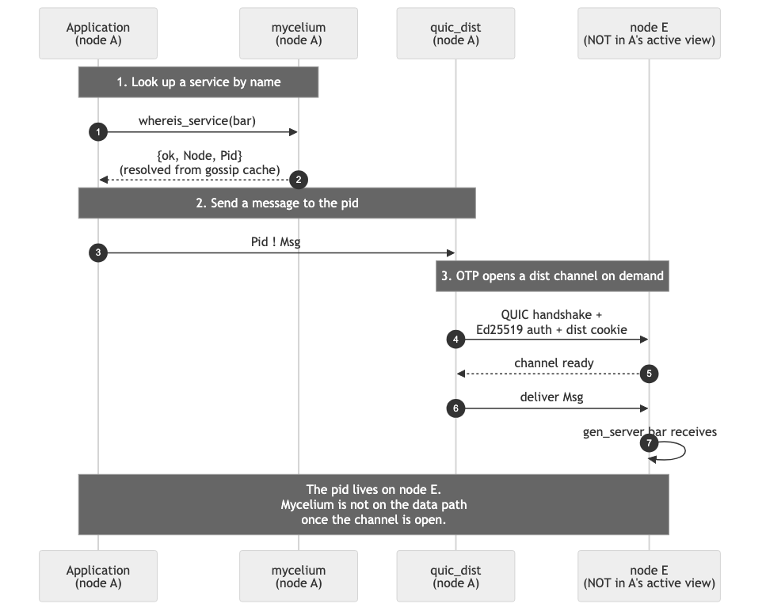

# Barrel P2P

Barrel P2P is an Erlang/OTP library for peer-to-peer clusters.

It keeps the Erlang programming model: `Pid ! Msg`, `gen_server`,
`rpc`, links, monitors, and the usual supervision habits. It changes
what happens underneath:

- distribution runs over QUIC, not TCP;
- nodes authenticate with Ed25519;
- membership is bounded with HyParView, not full mesh;
- services are discovered through a CRDT registry;
- EPMD is not required.

The result is a cluster where each node keeps a small number of gossip
connections, while any process can still talk to any process in the
cluster.

## Why Erlang developers may care

Standard Erlang distribution is simple and good. It becomes harder to
operate when the cluster grows, when every node must connect to every
other node, when EPMD is not welcome, or when nodes move between
network paths.

Barrel P2P keeps your application code close to normal OTP code. You
still register processes, call servers, monitor pids, and send
messages. The library takes care of the cluster shape, peer identity,
service discovery, and the QUIC dist carrier.

## The cluster shape

Read this graph from node A. The green nodes are the active view:
the small set of peers node A uses for gossip and membership
maintenance. The grey nodes are known peers kept in the passive view.
They are not connected now, but they are warm spares when the topology
changes.



The important point: the active view is not the cluster. It is not
the list of nodes your application may talk to. It is only the
maintenance topology.

Application traffic is different. If code on node A sends to a pid on
node E, OTP can open a dist channel on demand. Barrel P2P authenticates
that channel, then the normal Erlang message is delivered.



Once you hold the pid, Barrel P2P is no longer on the application data
path. You use Erlang.

## Project status

Barrel P2P is experimental and pre-1.0. APIs may change between minor
releases until a `1.0` tag.

The cryptographic and transport layers, Ed25519 dist auth and the
QUIC carrier, have unit and multi-node test coverage. They have not
been independently audited. Do not use Barrel P2P where a transport
compromise would be costly without doing your own review first.

Bug reports and PRs are welcome. Security reports go through
[SECURITY.md](SECURITY.md).

## Five-minute start

Add Barrel P2P to `rebar.config`:

```erlang
{deps, [
    {barrel_p2p, "0.1.0"}
]}.
```

Use Barrel P2P as the Erlang distribution carrier:

```text
-proto_dist barrel_p2p
-epmd_module barrel_p2p_epmd
-start_epmd false
```

Start the application and join a seed:

```erlang
application:ensure_all_started(barrel_p2p).
ok = barrel_p2p:join('seed@192.168.1.10').
```

Register the current process as a service:

```erlang
ok = barrel_p2p:register_service(worker_pool, #{shard => 1}).
```

Find it from another node:

```erlang
{ok, _Node, Worker} = barrel_p2p:whereis_service(worker_pool),
Worker ! {work, <<"payload">>}.
```

That send is a standard Erlang send. `whereis_service/1` returns
`{ok, Pid}` for a local service and `{ok, Node, Pid}` for a remote
one. If the target node is not already connected, the dist channel is
opened on demand over QUIC.

## Configuration

A small development config:

```erlang
{barrel_p2p, [
    {active_size, 5},
    {passive_size, 30},
    {listen_port, 9100},
    {contact_nodes, ['seed@192.168.1.10']},
    {auth_enabled, true},
    {auth_trust_mode, tofu}
]}.
```

The defaults are intentionally narrow:

- `active_size` bounds the number of gossip peers.
- `passive_size` bounds the known-but-disconnected peer cache.
- `listen_port` is the UDP port for QUIC distribution.
- `contact_nodes` gives the node a first place to join.
- `auth_trust_mode` is `tofu` or `strict`.

For production notes, see [run in production](docs/how-to/run-in-production.md).

## What is included

- **QUIC distribution**. `-proto_dist barrel_p2p` plugs into Erlang's
  alternative distribution layer. No stock EPMD daemon is required.
- **HyParView membership**. Each node keeps a bounded active view
  instead of a full mesh.
- **Service registry**. Processes can be registered by name and found
  from any node through a CRDT-backed registry.
- **Replicated state**. `barrel_p2p_map` is a gossiped, last-write-wins
  key-value map for cluster-wide config, flags, and routing tables;
  the `barrel_p2p_replica` behaviour underneath is public for custom
  merge.
- **Plumtree broadcast**. Registry changes and gossip move through an
  efficient epidemic broadcast tree.
- **Ed25519 peer identity**. Nodes prove their identity after the QUIC
  TLS handshake and before application traffic flows.
- **Tagged QUIC streams**. Applications can open tagged streams for
  large or byte-oriented transfers.
- **Operational tools**. Helpers exist for one-shot RPC, TLS material,
  key rotation, metrics, migration, and test clusters.

## Documentation

The docs are organised into five sections. Each section has a hub
page that lists its children; the hub pages are linked below.

### Overview

Read this first if barrel_p2p is new to you.

- [What is barrel_p2p?](docs/overview/what-is-barrel_p2p.md) — the
  project in one page, with the architecture diagram and the
  load-bearing ideas.
- [Benefits and trade-offs](docs/overview/benefits.md) — why pick
  barrel_p2p, and what you give up.
- [Introduction](docs/overview/introduction.md) — the long
  narrative through every layer.
- [Getting started](docs/overview/getting-started.md) — boot two
  nodes and send a real message.

### Core concepts

How each subsystem works, explained one page at a time.

- [Cluster membership](docs/concepts/cluster-membership.md) —
  HyParView's bounded active and passive views.
- [Service registry](docs/concepts/service-registry.md) — OR-Map
  CRDT, eventual consistency, the registration lifecycle.
- [Gossip broadcast](docs/concepts/gossip-broadcast.md) — Plumtree
  push-lazy-push trees, self-healing graft/prune.
- [Dist channel](docs/concepts/dist-channel.md) —
  `-proto_dist barrel_p2p` over QUIC, the discovery chain, the
  idle GC.
- [Authentication](docs/concepts/authentication.md) — Ed25519
  mutual challenge-response, trust modes.
- [Streams](docs/concepts/streams.md) — tagged user-stream
  multiplex over the same QUIC connection.
- [Connection migration](docs/concepts/connection-migration.md) —
  RFC 9000 §9 path rebind.
- [Hybrid logical clocks](docs/concepts/hybrid-logical-clocks.md) —
  the timestamps the CRDT uses.

### Tutorials

End-to-end walkthroughs.

- [Hello, cluster](docs/tutorials/hello-cluster.md) — the
  smallest two-node walkthrough.
- [Distributed chat](docs/tutorials/distributed-chat.md) — a
  small application that uses the service registry and service
  events.

### How-to guides

Task-focused recipes for operating a cluster.

- [Run in production](docs/how-to/run-in-production.md) — sizing,
  network surface, secrets, shutdown.
- [Configure authentication](docs/how-to/configure-authentication.md)
  — TOFU and strict modes, provisioning, rotation.
- [Observe a cluster](docs/how-to/observe-cluster.md) — metrics
  catalogue and exporter wiring.
- [Troubleshoot](docs/how-to/troubleshoot.md) — symptom-cause-fix
  tables.
- [Migrate connections](docs/how-to/migrate-connections.md) — a
  watchdog recipe for path migration.
- [Route through a relay](docs/how-to/route-through-relay.md) —
  wiring an external tunnel or proxy adapter.
- [Run the tests](docs/how-to/run-tests.md) — EUnit, Common Test,
  docker, and soak suites.

### Reference

Authoritative material when you know what you are looking for.

- [API overview](docs/reference/api-overview.md) — every public
  function in `barrel_p2p.erl`, grouped by subsystem.
- [Configuration](docs/reference/configuration.md) — every key
  under `{barrel_p2p, [...]}` in sys.config.
- [Architecture](docs/reference/architecture.md) — the full
  supervision tree and protocol-level details.
- [Comparison with Partisan](docs/reference/comparison-with-partisan.md)
  — side-by-side, when to pick which library.
- [Feature stability](docs/features.md) — public API tiers and
  coverage.

## Example application

A small distributed chat app lives under
[`examples/chat`](examples/chat/README.md).

```bash
cd examples/chat
./scripts/run-demo.sh seed
./scripts/run-demo.sh node 1
```

The demo starts Erlang nodes with `-proto_dist barrel_p2p`, generates
local TLS and Ed25519 material on first boot, and uses the service
registry to find chat rooms across the cluster.

## Testing

Run the local suites:

```bash
rebar3 eunit
rebar3 ct
```

The Docker scripts under `docker/scripts/` exercise multi-node
clusters. See [run the tests](docs/how-to/run-tests.md) for the
full command list.

## API reference

Generate HTML documentation:

```bash
rebar3 ex_doc
```

## Versioning

Barrel P2P is still in `0.x`.

- Minor bumps, `0.x` to `0.y`, may change documented public APIs.
- Patch bumps, `0.x.y` to `0.x.y+1`, are non-breaking.
- `1.0` will come after an external audit of the dist auth and
  transport layers, and after public user feedback on a `0.x` release.

Public API stability tiers are tracked in [docs/features.md](docs/features.md).
Anything not listed there is internal.

## License

Apache-2.0
